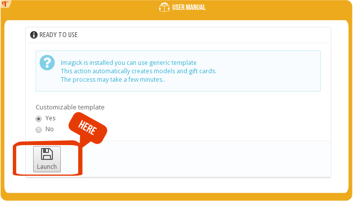
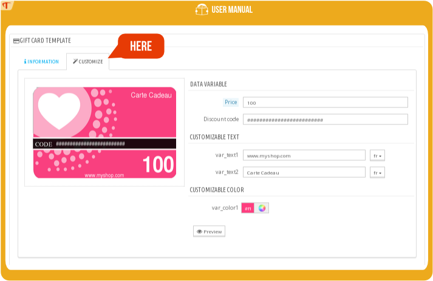
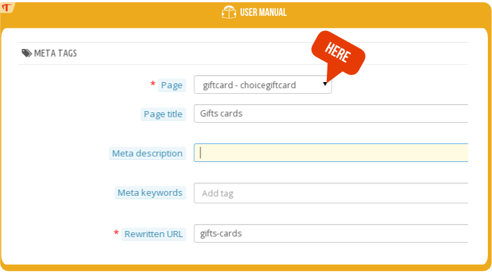
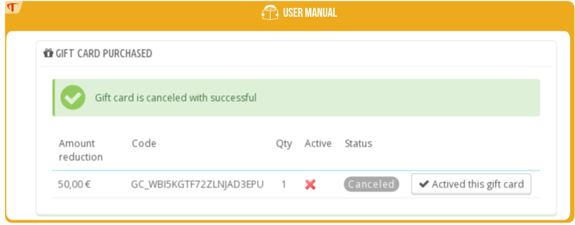
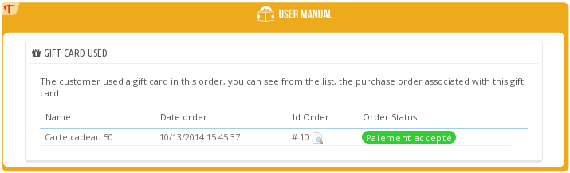
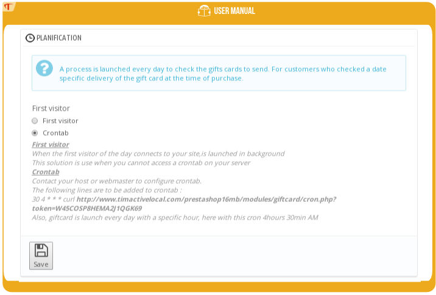

# Installation guide

## System requirements

- Your version of Prestashop must be >= 1.5
- You have gift card module 

## Installation

1) First visit the backoffice(administration page) of Prestashop http://www.myshop.com/admin***/

2) Click the 'Modules' tab

3) Choose 'Add a new module' Click on the 'Choose a file' button.
> 

4) Once uploaded, the module will appear in the tab ‘Prices and Promotion’
> 

5) The module has now been successfully installed.

## Getting started / Ready to use

This action automatically creates templates and gift cards 10,30,50,100,150.
The process can take several minutes.
> 

You have 2 options :

- *Yes*: Permit use customize Template with SVG extension(Require PHP Imagick extension http://php.net/manual/en/imagick.setup.php)
- *No* : Use only JPEG Image(many user prefer this option more easy to use and not require any hosting configuration)

And click "launch"
# User guide

## Using Templates

### Backoffice

Go to ‘Catalog’ and select -> ‘Templates Gift Cards’

> 

### List of templates

This screen lists the templates with the details of each one.
> 

On this screen you can add, modify, copy, or delete a template.

- *Status* tells you if the template is active and thus visible to your clients.

- *Default* you must have a default template ; this will be used to generate the thumbnails of your products and will be pre-selected in the list of templates listed on the Gift Card front office page.

- *Physical* The template is display and can be selected when your customer select "send by post" reception mode*

- *eCard* The template is display and can be selected when your customer select "send by email/print at home" reception mode*

### Add a template

Click the ‘Add new’ button.
> 

Information :

- *Name* : this will be displayed on the Gift Card front office page

- *Tags* : displayed on the front office page ; your customers will be able to select a template based on the occasion : ‘birthday, Valentine’s Day…’

- *Language*: if selected, the design will be displayed in the language of the customer; if not, then in whichever language you use

- *Image* : This is the image of your gift card. You have two choices: upload a vector graphic in SVG format, in which case the template will considered customizable (and a new tab will appear), or upload a JPEG, in which case the template will not be customizable.

### Customization table

If the image you upload is in .svg format, the ‘Customize’ tab will appear.
This screen allows you to customize your template with your logo or whatever else you would like.
> 

#### Data variable

Data Variables are the aspects which vary according to the order.
For your information: enter 0 for ‘Price’ if you do not want to show the price on the card.

#### Customizable text

Customizable text: all the text can be translated, so the template can be adapted to your customer’s language.

#### Creation of your own templates

The creation of your own templates is explained in the 'Customization of your gift card templates' section of this document.

## Using gift cards

### Backoffice

Note: A gift card is a product with specific and customizable characteristics.
Go to ‘Catalog’ and select-> ‘Gift Cards’
> 

### List of gift cards

If you installed and click ready-to-use, gift cards will already be installed.
On this screen, you can add, change, copy or delete a gift card.
> 

- *Status* allows you to see if the card is active and thus visible to your customers.

- *eCard* if checked, the amount is display when reception mode "print at home" or "send by email" is selected
by your customer. Else the amount is display for reception mode "send by post".

- *default* gift card: corresponds to the amount selected by default on your front office page.

Note: the Gift Card module allows you to set the price of the cards, whatever the currency.

### Add a gift card

> 

- *Name* name of the product, which will appear in the shopping cart, on the invoice…
- *Currency* if selected, this will appear on the gift card in the customer’s currency
- *Price* price of the card. Purchase of the card will generate a voucher for the same amount.
- *Period of Validity* the duration for which the voucher will be valid after the purchase of the gift card.

Useful information if you are also working with paper gift cards

- *Quantity* the quantity available. Gift cards can be ordered even if the stock is at 0.
- *Reference*
- *EAN13*
- *UPC*

## Front office page

### Screen

The module include several themes for the page dedicated to the choice of gift card. You can select the theme you prefer in the module configuration (if you have any recommendations or improvements do not hesitate to submit them to us)
> 

The *"basic"* theme: works without bootstrap and tested on the default theme of versions 1.5, 1.6, 1.7 of Prestashop.
> 

The *"classic"* theme: requires bootstrap has been tested on the default theme of versions 1.6, 1.7 of Prestashop.

> 

### Information

#### Reception mode:

*Print at home*
Below is a diagram summarizing the process. Only the sender of the gift card receives the email containing the gift card; he can then print either the email or the pdf in order to hand-deliver it.
> 

*Send by email*
On the delivery date, an email will be sent to the recipient with his personalized gift card. An email notification will also be sent to the sender to let him know that the gift card has been delivered.
> 

*Send by post*
The customer will receive the gift card by post and will pay a shipping cost(depending your shop configuration). The order will no longer be considered virtual because the gift card product is physical.
This option is show only if you have physical gift card product and gift card template.
Below is a diagram summarizing the process. 
> 

#### Amount

Allows you to select the amount of the gift card. The amount selected by default is defined in the Back-Office →  Catalog → Gift Card

#### From

Name of the person who is giving the gift card. This name will appear in the PDF as well as the email sent to the recipient.

#### To

Name of the person receiving the gift card.

#### Message:

The message which will accompany the gift card. This message will appear in the email as well as the PDF.

### Configuration of text

You can change the text during the setup of the module. See the ‘Front office and configuration’ section.
> 

### Height and width of images

The height and width of the images can be adjusted during the setup of the module. See the ‘Front office and configuration’ section.
> 

If you adjust the height and width of the images, you will have to regenerate the images for modifying each of the templates.

## Seo & URLs

Add the necessary information for SEO.

### Backoffice

Go to the ‘SEO & URLs’ tab in your Back Office
> 

### Add page

Click on the ‘Add New’ button.
Select the page ‘giftcard – choicegiftcard’ as shown in the example below
> 

## Customize labels in the shopping cart

You can change the labels during the setup of the module. See the ‘Front office and configuration’ section.
> 

These labels are visible in the shopping cart, the order, and the invoice, as shown below
> 

The content within the box has been personalized by the customer.

## PDF

The PDF is sent by email to the customer and to the gift card recipient. You can view and print the PDF by visiting the order in the Back Office.
The gift card module allows you to customize the PDF in simple HTML format and preview the result.
The PDF can be customized during the setup of the module. See the section ‘PDF.’
> 

### Fields

#### Prefix

Prefix of the name of the PDF file.

#### PDF content

The content in simple HTML format which will be generated in PDF format.

#### Order information

These will be filled in by the information provided during the order.

- *{$card_from}* : ‘From’ name entered during gift card purchase
- *{$card_lastname}* : 'Recipient' name of recipient entered during gift card purchase
- *{$card_price}* : amount of the gift card
- *{$card_code}* : discount code generated during purchase
- *{$card_message}* : message entered during purchase
- *{$card_expirate}* : expiration date of the gift card
- *{$card_image}* : image corresponding to the template selected during purchase
- *{$shop_name}* : name of boutique
- *{$shop_link}* : link to your boutique
- *{$width_logo}* : width of boutique logo (in pixels)
- *{$height_logo}* : height of logo (in pixels)
- *{$logo_path}* : URL of logo image

#### Width and Height of image

Use this to integrate the image into your PDF

#### Save and Preview

Allows you to save the completed form and see a preview in your previously selected language.

## Backoffice order

The gift card module allows you to view and manage gift card orders by accessing the Back Office. Find the ‘Orders’ tab in order to view gift card orders that have been placed.
This section addresses the management of:
- an order including one or more gift cards
- an order placed using a gift card as payment

### Receipt of a gift card order

If an order contains one or more gift cards, you will see ‘Gift Card Purchased’ information block.
> 

This information block allows you to:

- Preview and print the PDF
- Cancel a gift card
- View the details, code, and amount of discount voucher
- View the status of the gift card (used or unused), and, for used cards, view the order for which the voucher was used

Different cases are possible on this screen:

#### Order awaiting payment (check, wire transfer)

The email is not sent and the voucher for the order is not generated
> 

#### Order with accepted payment

The code is generated and the email is sent
> 

#### Canceled order

A message indicates the gift card should be canceled
> 

#### Canceling a gift card

> 

#### Activating a previously canceled gift card

> 

#### Used

A message indicates the gift card has been used in order #11. You can consult the associated order.
> 

#### Used card whose order has been canceled

The gift card was used before the card could be canceled.
> 

### Receipt of order placed with a gift card

This screen allows you to:
- Consult the order associated with a gift card
- Receive an alert if the order associated with the gift card is invalid (canceled, reimbursed)

> 

Different possible cases:

#### Valid orders

> 

#### Invalid orders

> 

## Backoffice overview of gift cards purchased

This screen allows you to access:

- Information about gift cards purchased (amount, template)
- The orders associated with the cards
- The status of purchases
- Information about the personalization of the gift cards
- Reception modes: Print at home, Send by email
- The record of actions taken: emails sent or actions taken by your employees (cancellation or activation of gift cards)
‘Orders’ tab → ‘Gift Cards’

> 

## Planification for gift card delivery

This can be modified in the configuration of the module. See section ‘Planification’

> 

The gift card module must verify daily which gift cards should be sent according to the delivery date selected by the customer during purchase.
A script is executed daily. The module offers two options :

###   First visitor launch

It is the first visitor of the day, or can also be a crawler (Google, Bing,…)
Technically: the module attaches to hookFooter, and when the first visitor goes on your site, the module is notified. The gift card module will verify the gift cards to be sent.
The problem with this method is its dependence on site visits, and the inability to plan an exact date and time of delivery.

###   CRONTAB

This is the recommended method, which allows you to select the exact time of delivery. 
Contact your Webmaster or host so they can put in place the line indicated in bold on the module configuration page.
For example, the line to use in crontab for the site prestashopdemo.timactive.com is:
> ``30 4 * * * curl http://prestashopdemo.timactive.com/modules/giftcard/cron.php&token=PVUNZXE23JRKFS6QI4L8``

## Customize Template with Inkscape

Further information about customization…
This section shows you how to customize a gift card template based on an existing template.

Note: dimensions of a gift card—height: 300 px, width: 191 px. Dimensions of reference used for example for credit cards.

The software used in this tutorial is inkspace, the recommended free software for creating vector images.

### Installing inkscape software

http://www.inkscape.org/fr/telechargement/

Launch inkscape.

### Using an existing template

Find the list of available templates in the gift card module in [your_shop]/modules/giftcard/datadefault/template/ par exemple 1.svg,2.svg...
In inkscape, File->Open and find the svg file you would like to use as your template.
> 

### Simple modification

#### Importing your logo

The logo you are importing must be high-resolution.
For example, below, the Timactive logo, symbolized by TA, has been integrated into the template. The logo was already in SVG format.
To do this, go to: File → Import →Select your logo
> 

#### Selecting your options

If you want to add additional elements, you must ensure that the gift card module will accept them by following the naming rules below :

- *giftcard_price* : price of the gift card
- *giftcard_code* : code of the gift card
- *var_color1*, *var_color2*, *var_color3*,...., *var_color10* : the different types of colors (you can define at most 10 colors)
- *var_text1*, *var_text2*, *var_text3*,...., *var_text10* : the different types of text (you can define at most 10)

#### Additional text

As indicated above, text options must begin with 'var_text' + a number, i.e. : var_textMYNUMBER, and the number must be less than 10
See below the example of additional text 'Mon texte'
> 

