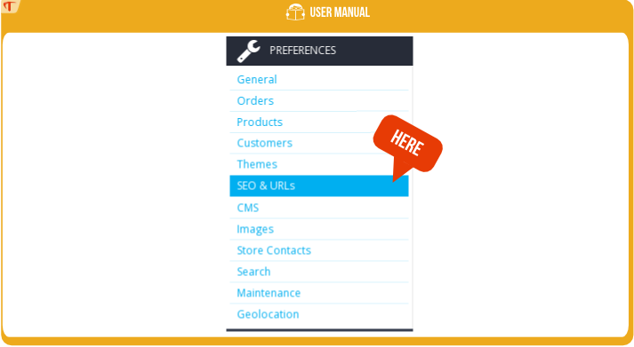
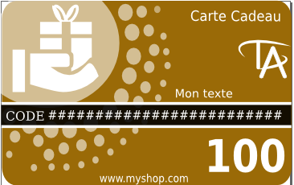

# Guía de instalación

## Requisitos del sistema

- Tu versión de Prestashop debe ser >= 1.5
- Tener el módulo de tarjeta de regalo 

## Instalación

1) Primero visite el backoffice (página de administración) de Prestashop http://www.myshop.com/admin***/

2) Haga clic en la pestaña "Módulos"

3) Seleccione 'Añadir un nuevo módulo' Haga clic en el botón 'Elija un archivo'.
> 

4) Una vez cargado, el módulo aparecerá en la pestaña 'Precios y Promoción'
> 

5) El módulo se ha instalado correctamente.

## Primeros pasos / Preparar para usar

Esta acción crea automáticamente plantillas y tarjetas de regalo 10,30,50,100,150.
El proceso puede tardar varios minutos.
> 

Usted tiene 2 opciones:

- *Sí*: Permite usar la plantilla personalizada con extensión SVG (Requiere la extensión PHP Imagick http://php.net/manual/en/imagick.setup.php)
- *No* : Utilizar sólo JPEG (muchos usuarios prefieren esta opción más fácil de usar y que no requiere ninguna configuración en su alojamiento)

Y haga clic en "puesta en marcha"

# Guía del usuario

## Uso de plantillas

### Backoffice

Vaya a 'Catálogo' y seleccione -> 'Plantillas de Tarjetas regalo'
> 

### Lista de plantillas

Esta pantalla enumera las plantillas con los detalles de cada una.
> 

En esta pantalla puede agregar, modificar, copiar o eliminar una plantilla.

- *Estado* le indica si la plantilla está activa y, por lo tanto, visible para sus clientes.

- *Predeterminado* debe tener una plantilla predeterminada; Ésta se utilizará para generar las miniaturas de sus productos y se preseleccionará en la lista de plantillas que aparecen en la página de la tarjeta de regalo.

- *Física* La plantilla se muestra y se puede seleccionar cuando su cliente seleccione el modo de recepción* "enviar por correo"

- *eCard* La plantilla se muestra y se puede seleccionar cuando su cliente seleccione el modo de recepción* "enviar por correo electrónico / imprimir en casa"

### Añadir una plantilla

Haga clic en el botón "Añadir nueva".
> 

Información :

- *Nombre* : Esto se mostrará en la página de la tarjeta de regalo

- *Etiquetas* : Se muestran en la página principal; Sus clientes podrán seleccionar una plantilla basada en la ocasión: 'cumpleaños, día de San Valentín ...'

- *Idioma*: si se selecciona, el diseño se mostrará en el idioma del cliente; Si no, en el idioma que usted use

- *Imagen*: Esta es la imagen de su tarjeta de regalo. Tiene dos opciones: cargar un gráfico vectorial en formato SVG, en cuyo caso la plantilla se considerará personalizable (y aparecerá una nueva pestaña) o cargar en JPEG, en cuyo caso la plantilla no será personalizable.

### Tabla de personalización

Si la imagen que suba está en formato .svg, aparecerá la pestaña "Personalizar".
Esta pantalla le permite personalizar su plantilla con su logotipo o cualquier otra cosa que le gustaría.
> 

#### Variables de datos

Variables de datos son los aspectos que varían según el pedido.
Para su información: ingrese 0 para 'Precio' si no desea mostrar el precio en la tarjeta.

#### Customizable text

Customizable text: all the text can be translated, so the template can be adapted to your customer’s language.

#### Creación de sus propias plantillas

La creación de sus propias plantillas se explica en la sección "Personalización de las plantillas de tarjeta regalo" de este documento.

## Uso de las tarjetas regalo

### Backoffice

Nota: Una tarjeta de regalo es un producto con características específicas y personalizables.
Vaya a 'Catálogo' y seleccione-> 'Tarjetas Regalo'
> 

### Lista de tarjetas regalo

Si durante la instalación hizo clic en preparar para usar, ya habrá tarjetas de regalo instaladas.
En esta pantalla, puede agregar, cambiar, copiar o eliminar una tarjeta regalo.
> 

- *Estado* le permite ver si la tarjeta está activa y, por tanto, visible para sus clientes.

- *eCard* si está marcada, la cantidad se muestra cuando se selecciona el modo de recepción "imprimir en casa" o "enviar por correo electrónico"
por su cliente. De lo contrario la cantidad se muestra para el modo de recepción "enviar por correo".

- *predeterminada* tarjeta regalo: corresponde a la cantidad seleccionada de forma predeterminada en la página principal.

Nota: el módulo Tarjeta de regalo le permite establecer el precio de las tarjetas, independientemente de la moneda.

### Añadir una tarjeta de regalo

> 

- *Nombre* nombre del producto, el cual aparecerá en el carrito de la compra, en la factura...
- *Moneda* si está seleccionado, la moneda del cliente aparecerá en la tarjeta de regalo
- *Precio* precio de la tarjeta. La compra de la tarjeta generará un vale por la misma cantidad.
- *Período de Validez* la duración para la cual el vale será válido después de la compra de la tarjeta de regalo.

Información útil si también está trabajando con tarjetas de regalo en papel

- *Cantidad* la cantidad disponible. Las tarjetas de regalo se pueden pedir incluso si el stock está en 0.
- *Referencia*
- *EAN13*
- *UPC*

## Página del Front office

### Pantalla

El módulo incluye varios temas para la página dedicada a la elección de la tarjeta de regalo. Puede seleccionar el tema que prefiera en la configuración del módulo (si tiene alguna recomendación o mejoras no dude en enviárnoslas)
> 

El tema *"básico"*: funciona sin bootstrap y está probado en el tema por defecto de las versiones 1.5, 1.6, 1.7 de Prestashop.
> 

El tema *"clásico"*: requiere bootstrap y ha sido probado en el tema por defecto de las versiones 1.6, 1.7 de Prestashop.

> 

### Información

#### Modo de recepción:

*Impresión en casa*
A continuación se muestra un diagrama que resume el proceso. Sólo el remitente de la tarjeta de regalo recibe el correo electrónico que contiene la tarjeta de regalo; Él puede entonces imprimir el email o el pdf para entregarlo manualmente.
> 

*Enviar por correo electrónico*
En la fecha de entrega, se enviará un correo electrónico al destinatario con su tarjeta de regalo personalizada. También se enviará una notificación por correo electrónico al remitente para informarle que la tarjeta de regalo ha sido entregada.
> 

*Enviar por correo*
El cliente recibirá la tarjeta de regalo por correo y pagará un coste de envío (dependiendo de la configuración de su tienda). El pedido ya no se considerará virtual porque el producto de la tarjeta de regalo es físico.
Esta opción sólo se muestra si tiene un producto físico de tarjeta de regalo y una plantilla de tarjeta de regalo.
A continuación se muestra un diagrama que resume el proceso.
> 

#### Importe

Le permite seleccionar el importe de la tarjeta de regalo. El importe seleccionado de forma predeterminada se define en el Back-Office → Catálogo → Tarjeta de regalo

#### De

Nombre de la persona que envía la tarjeta de regalo. Este nombre aparecerá en el PDF, así como el correo electrónico enviado al destinatario.

#### Para

Nombre de la persona que recibe la tarjeta de regalo.

#### Mensaje:

El mensaje que acompañará a la tarjeta de regalo. Este mensaje aparecerá en el correo electrónico, así como en el PDF.

### Configuración del texto

Puede cambiar el texto durante la configuración del módulo. Consulte la sección 'Configuración del Front office'.
> 

### Altura y anchura de las imágenes

La altura y el ancho de las imágenes se pueden ajustar durante la configuración del módulo. Consulte la sección 'Configuración del Front office'.
> 

Si ajusta la altura y el ancho de las imágenes, tendrá que regenerar las imágenes para modificar cada una de las plantillas.

## Seo & URLs

Agregue la información necesaria para SEO.

### Backoffice

Vaya a la pestaña 'SEO y URLs' en su Back Office
> 

### Añadir página

Haga clic en el botón "Añadir nueva".
Seleccione la página 'giftcard - choicegiftcard' como se muestra en el ejemplo siguiente
> 

## Personalizar etiquetas en el carrito de la compra

Puede cambiar las etiquetas durante la configuración del módulo. Consulte la sección 'Configuración del Front office'.
> 

Estas etiquetas están visibles en el carrito de la compra, el pedido y la factura, como se muestra a continuación
> 

El contenido dentro de la caja ha sido personalizado por el cliente.

## PDF

El PDF se envía por correo electrónico al cliente y al destinatario de la tarjeta de regalo. Puede ver e imprimir el PDF visitando el pedido en el Back Office.
El módulo de tarjeta de regalo le permite personalizar el PDF en formato HTML simple y obtener una vista previa del resultado.
El PDF se puede personalizar durante la configuración del módulo. Vea la sección 'PDF'.
> 

### Campos

#### Prefijo

Prefijo del nombre del archivo PDF.

#### Contenido PDF

El contenido en formato HTML simple que se generará en formato PDF.

#### Información del pedido

Será rellenada por la información proporcionada durante el pedido.

- *{$card_from}*: 'De' nombre introducido durante la compra de la tarjeta de regalo
- *{$card_lastname}*: 'Destinatario' nombre del destinatario ingresado durante la compra de la tarjeta de regalo
- *{$card_price}*: cantidad de la tarjeta de regalo
- *{$card_code}*: código de descuento generado durante la compra
- *{$card_message}*: mensaje ingresado durante la compra
- *{$card_expirate}*: fecha de caducidad de la tarjeta regalo
- *{$card_image}*: imagen correspondiente a la plantilla seleccionada durante la compra
- *{$shop_name}*: nombre de la tienda
- *{$shop_link}*: enlace a su tienda
- *{$width_logo}*: ancho del logotipo de la tienda (en píxeles)
- *{$height_logo}*: altura del logotipo (en píxeles)
- *{$logo_path}*: URL de la imagen del logotipo

#### Anchura y altura de la imagen

Use esto para integrar la imagen en su PDF

#### Guardar y previsualizar

Le permite guardar el formulario completado y ver una vista preliminar en el idioma seleccionado anteriormente.

## Pedido en el Backoffice

El módulo de tarjeta de regalo le permite ver y administrar pedidos de tarjetas de regalo accediendo al Backoffice. Encuentre la pestaña 'Pedidos' para ver los pedidos de tarjetas regalo que se han realizado.
Esta sección se ocupa de la gestión de:
- un pedido que incluya una o más tarjetas de regalo
- un pedido realizado usando una tarjeta de regalo como pago

### La recepción de un pedido de tarjeta regalo

Si un pedido contiene una o más tarjetas de regalo, verá el bloque de información 'Tarjeta de regalo comprada'.
> 

Este bloque de información le permite:

- Previsualizar e imprimir el PDF
- Cancelar una tarjeta de regalo
- Ver los detalles, el código y la cantidad del bono de descuento
- Ver el estado de la tarjeta de regalo (utilizada o no utilizada) y, para las tarjetas utilizadas, ver el pedido para el que se utilizó el vale

Diferentes casos son posibles en esta pantalla:

#### Pedido pendiente de pago (cheque, transferencia bancaria)

El correo electrónico no se envía y no se genera el bono para el pedido
> 

#### Pedido con pago aceptado

El código se genera y se envía el correo electrónico
> 

#### Pedido cancelado

Un mensaje indica que la tarjeta de regalo debe cancelarse.
> 

#### Cancelar una tarjeta de regalo

> 

#### Activación de una tarjeta de regalo cancelada anteriormente

> 

#### Usada

Un mensaje indica que la tarjeta de regalo se ha utilizado en el pedido #11. Puede consultar el pedido asociado.
> 

#### Tarjeta utilizada cuyo pedido ha sido cancelado

La tarjeta de regalo se usó antes de que la tarjeta pudiera ser cancelada.
> 

### Recepción de un pedido realizado con una tarjeta de regalo

Esta pantalla le permite:
- Consultar el pedido asociado a una tarjeta de regalo
- Recibir una alerta si el pedido asociado a la tarjeta de regalo no es válido (cancelado, reembolsado)

> 

Diferentes casos posibles:

#### Pedidos válidos

> 

#### Pedidos no válidos

> 

## Visión general en el Backoffice de las tarjetas de regalo compradas

Esta pantalla le permite acceder a:

- Información sobre las tarjetas de regalo compradas (cantidad, plantilla)
- Los pedidos asociados a las tarjetas
- El estado de las compras
- Información sobre la personalización de las tarjetas regalo
- Modos de recepción: Imprimir en casa, Enviar por correo electrónico
- Registro de las acciones realizadas: correos electrónicos enviados o acciones realizadas por sus empleados (cancelación o activación de tarjetas regalo)
Pestaña 'Pedidos' → 'Tarjetas regalo'

> 

## Planificación para la entrega de tarjetas regalo

Esto se puede modificar en la configuración del módulo. Véase la sección ‘Planificación’

> 

El módulo de tarjeta de regalo debe verificar diariamente qué tarjetas de regalo se deben enviar de acuerdo con la fecha de entrega seleccionada por el cliente durante la compra.
Un script se ejecuta diariamente. El módulo ofrece dos opciones:

### Lanzamiento con el primer visitante

Con el primer visitante del día, o también puede ser un rastreador (Google, Bing, ...)
Técnicamente: el módulo se conecta a hookFooter, y cuando el primer visitante entra en su sitio, el módulo es notificado. El módulo de tarjeta regalo verificará las tarjetas regalo que deben enviarse.
El problema con este método es su dependencia de las visitas al sitio, y la imposibilidad de planificar una fecha y hora exactas de entrega.

###   CRONTAB

Este es el método recomendado, que le permite seleccionar la hora exacta de entrega.
Póngase en contacto con su Webmaster o host para que puedan colocar la línea indicada en negrita en la página de configuración del módulo.
Por ejemplo, la línea a utilizar en crontab para el sitio prestashopdemo.timactive.com es:
> ``30 4 * * * curl http://prestashopdemo.timactive.com/modules/giftcard/cron.php&token=PVUNZXE23JRKFS6QI4L8``

## Personalizar plantilla con Inkscape

Más información sobre personalización...
En esta sección se muestra cómo personalizar una plantilla de tarjeta de regalo basada en una plantilla existente.

Nota: dimensiones de una tarjeta regalo-altura: 300 px, ancho: 191 px. Dimensiones de referencia utilizadas, por ejemplo, para tarjetas de crédito.

El software utilizado en este tutorial es Inkscape, el software libre recomendado para crear imágenes vectoriales.

### Instalando el software inkscape

http://www.inkscape.org/fr/telechargement/

Lanzar Inkscape.

### Uso de una plantilla existente

Encuentra la lista de plantillas disponibles en el módulo de tarjetas de regalo en [your_shop]/modules/giftcard/datadefault/template/ por ejemplo 1.svg, 2.svg...
En inkscape, Archivo-> Abrir y encontrar el archivo svg que desea utilizar como su plantilla.
> 

### Modificación sencilla

#### Importación de su logotipo

El logotipo importado debe ser de alta resolución.
Por ejemplo, a continuación, el logotipo de Timactive, simbolizado por TA, se ha integrado en la plantilla. El logo ya estaba en formato SVG.
Para ello, vaya a: Archivo → Importar → Seleccionar su logo
> 

#### Selección de las opciones

Si desea agregar elementos adicionales, debe asegurarse de que el módulo de tarjeta de regalo los acepte siguiendo las siguientes reglas de nomenclatura:

- *giftcard_price*: precio de la tarjeta de regalo
- *giftcard_code*: código de la tarjeta de regalo
- *var_color1*, *var_color2*, *var_color3*, ...., *var_color10*: los diferentes tipos de colores (se pueden definir como máximo 10 colores)
- *var_text1*, *var_text2*, *var_text3*, ...., *var_text10*: los diferentes tipos de texto (se puede definir como máximo 10)

#### Texto adicional

Como se indicó anteriormente, las opciones de texto deben comenzar con 'var_text' + un número, es decir: var_textMYNUMBER, y el número debe ser menor de 10
Vea a continuación el ejemplo del texto adicional 'Mon texte'
> 