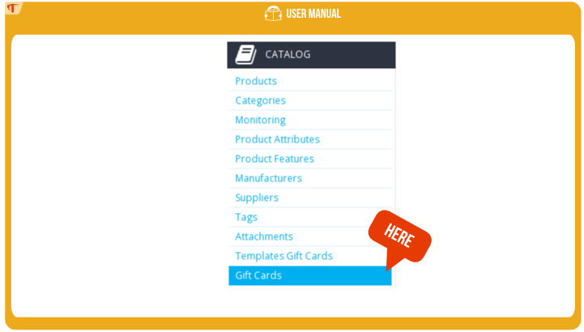
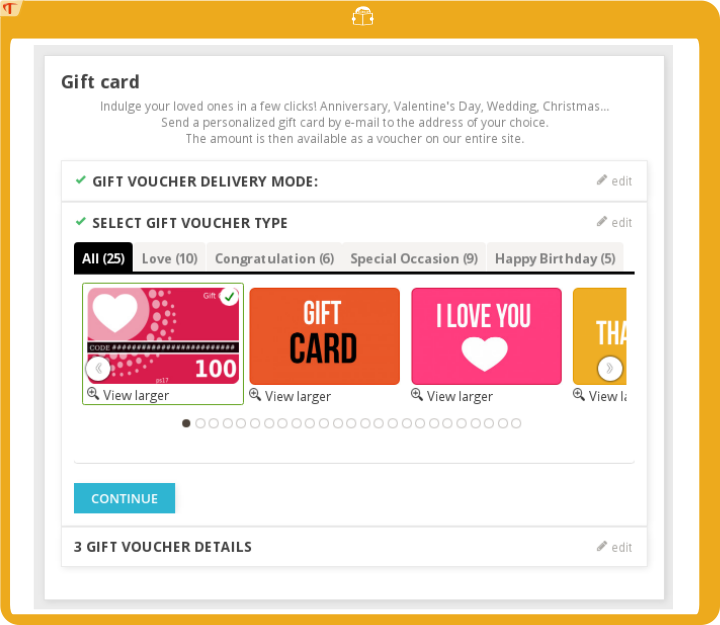
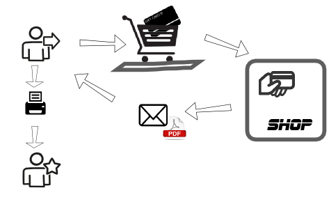
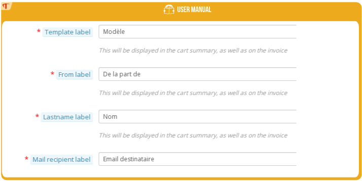
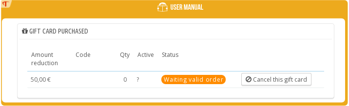
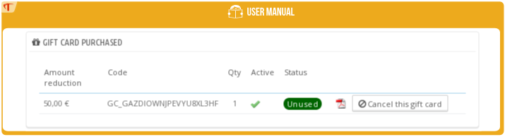
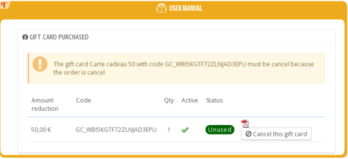

# Guide d'installation

## Pré-requis

- La version de votre Prestashop doit >= 1.5
- Vous disposez sur votre poste du module “Carte Cadeau”

## Installation

1) Vous devez vous rendre dans le Back Office(administration) de Prestashop  http://www.votreboutique.com/admin***/

2) Positionnez vous sur l'onglet “Modules” :

3) Ajouter un nouveau module
> 

4) Une fois « l'archive »  ajoutée «giftcard.zip »  cliquer sur le bouton « Mettre ce module en ligne » ou le bouton « charger le module ».
> 

5) Le module est maintenant installé avec succès.

## Prêt à l'emploi

Cette action créée automatiquement des modèles et des cartes cadeaux 10,30,50,100,150. 
Le processus peut prendre plusieurs minutes.
> 

Vous avez 2 options :

- *Yes*: Vous permet d'utiliser des modèles personnalisable avec l'extention SVG(L'extension PHP Imagick est requise http://php.net/manual/fr/imagick.setup.php)
- *No* : Utilisez seulement des images au format JPEG(de nombreux utilisateurs préfèrent cette option plus simple à utiliser et ne requière aucun installation sur votre hébergement)

Cliquez sur le bouton "lancer"

# Guide utilisateur

## Administration des modèles

### Backoffice

Rendez-vous  dans l'onglet 'Catalogue->Cartes Cadeaux Modèles'

> 

### Liste des modèles

Cet écran liste les modèles avec les informations associées à chacun.
> 

Dans cet écran vous pourrez ajouter, modifier, dupliquer ou supprimer un modèle.

- *Status* permet d'indiqué si le modèle est actif et ainsi visible de vos clients.

- *Default* Un modèle défaut est obligatoire, c'est lui qui sera utilisé pour générer les vignettes de vos produits, il sera présélectionné dans la liste des modèles, présent dans la page Carte cadeau front office.

- *Physique* Si votre client a sélectioné l'option "envoi postale" dans le mode de réception le modèle sera présenté

- *eCard* Si votre client a sélectioné l'option "envoi par email" ou "imprimer chez soi" dans le mode de réception le modèle sera présenté

### Ajouter un modèle

Cliquer sur le bouton créer
> 

Information :

- *Nom* : Affiché dans la page carte cadeau front office

- *Tags* : affiché sur le front office, vos clients pourront filtrer un modèle selon l'occasion : 'anniversaire, saint valentin, …'

- *Language*: si sélectionné, le modèle sera affiché selon la langue du client sinon quelque soit la langue.

- *Image* : C'est l'image de votre carte cadeau, vous avez deux choix, mettre en ligne une image vectoriel au format SVG, dans ce cas
le modèle sera considéré comme personnalisable(un nouvel onglet sera présent) ou télécharger une image JPEG.

### Onglet personnaliser

Si l'image que vous avez mis en ligne est au format .svg, l'onglet 'Personnaliser' apparaît.
Cet écran permet de personnaliser votre modèle selon votre identité visuel ou toute autre idée.
> 

#### Données variables

Ce sont les données qui varient selon la commande.
Pour information : indiquer 0 dans le prix pour ne pas afficher le prix dans le modèle.

#### Text personnalisable

Tous les textes peuvent être traduits, ainsi le modèle s'adaptera à la langue du client.

#### Creation de vos propres modèles

La création de vos propres modèles est expliquée dans la rubrique « Personnalisation de vos modèles de cartes cadeaux » de cette documentation.

## Administration des cartes cadeaux

### Backoffice

Note: Une carte cadeau est un produit avec des caractéristiques spécifiques et personnalisables.
Rendez vous Catalogue -> "Cartes Cadeaux"
> 

### Liste des produits cartes cadeaux

Si vous avez exécuter le batch prêt à l'emploi, des cartes cadeaux seront déjà installées.
Dans cet écran vous pourrez ajouter, modifier, dupliquer ou supprimer une carte cadeau.
> 

- *Statut* permet d'indiqué si le carte est active et ainsi visible de vos clients.

- *Virtuelle* Si votre client a sélectioné l'option "envoi par email" ou "imprimer chez soi" dans le mode de réception
sinon le montant sera présenté dans le cadre de la sélection du mode "envoi postale".

- *Defaut* correspond au montant sélectionné par défaut dans votre page front office.

Note: Le module  carte cadeau permet de fixer le prix des cartes  quelque soit  la devise.
Même si cela ne porte  aucun intérêt, pour garantir ce fonctionnement ne pas appliquer de promotion aux cartes cadeaux.

### Création et modification d'une carte cadeau

> 

- *Nom* nom du produit, il est affiché dans le panier, dans la facture...
- *Devise* si sélectionné affichera la carte cadeau en fonction de la devise du client
- *Prix* prix de la carte, après l'achat un coupon du même montant sera généré.
- *Période de validité*  correspond à la durée de validité du coupon après l'achat de la carte cadeau.

Informations utiles si vous gérez aussi des cartes cadeaux physiques 

- *Quantity* la quantité disponible. Les cartes cadeaux peuvent être commandés même si le stock est à 0.
- *Reference*
- *EAN13*
- *UPC*

## Front office page carte cadeau

### Ecran

Le module propose plusieurs thèmes pour la page dédiée au choix de la carte cadeau. Vous pouvez sélectionner le thème qui vous convient depuis la configuration du module.(Si vous avez des recommandations, n'hésitez pas à nous contacter)
> 

Le thème *"basic"* : fonctionne sans bootstrap, a été testé sur les thèmes défaut de Prestashop pour les versions 1.5, 1.6, 1.7 de Prestashop.
> 

Le thème *"classic"*: requiert que votre thème est bootstrap, a été testé sur les thèmes défaut de Prestashop pour les versions 1.6, 1.7 de Prestashop.
> 

### Information

#### Mode de réception:

*Imprimer chez soi*
Ci-dessous un schéma synthétisant le déroulement de l'opération, seul l'émetteur de la carte cadeau recoit le mail contenant la carte cadeau, il peut ainsi imprimer le mail ou le pdf afin de l'offrir en main propre.
> 

*Envoyer par e-mail*
Le jour de la date d'envoi, un mail est envoyé aux bénéficiaires avec les informations personnalisées. Un mail informatif est aussi envoyé au client afin d'informer que la carte cadeau a bien été transmise.
> 

*Envoi postale*
Le client recoit la carte cadeau par courrier(colis) et va ainsi payer des frais de port(suivant la configuration de votre boutique)
Le produit carte cadeau ne sera pas un produit virtual mais un produit standard.
Cette option est présenté si vous avez des cartes cadeaux avec l'option virtuel à non et que vous avez des modèles avec l'option physique à oui.
Ci-dessous un schéma synthétisant le déroulement de l'opération
> 

#### Montant

Permet de définir le montant de la carte cadeau, le montant sélectionné par défaut est définit dans le Back-Office → catalogue → Carte Cadeau

#### De la part de

Nom de la personne qui offre la carte cadeau, ce nom sera présent dans le PDF ainsi que le mail envoyé au bénéficiaire.

#### Bénéficiaire

Nom de la personne qui va recevoir la carte cadeau.

#### Message:

Le message qui va accompagner la carte cadeau, ce message sera présent dans le mail ainsi que le PDF.

### Paramétrage du texte

Le texte est paramétrable dans la configuration du module. Rubrique 'Front office et configuration'.
> 

### Hauteur et largeur des images

La hauteur et la largeur des images sont paramétrables dans la configuration du module. Rubrique 'Front office et configuration'.
> 

Si vous modifiez la hauteur et largeur des images vous devrez régénérer les images en modifiant chacun des modèles.

## Seo & URLs

Ajout des informations nécessaires pour le référencement de votre page carte cadeau.

### Backoffice

Rendez vous dans l'onglet SEO& URL de votre Back Office 
> 

### Ajouter une page

Cliquer sur le bouton créer
Sélectionner la page « giftcard - choicegiftcard » comme décrit dans l'exemple ci-dessous :
> 

## Personnaliser les labèles présenté dans le panier

Les labels sont paramétrables dans la configuration du module. Rubrique 'Front office et configuration'.
> 

Les labels sont visibles dans le panier, la commande et la facture. Comme présenté ci-dessous :
> 

L'encadré correspond à la personnalisation réalisée par le client.

## PDF

Le PDF est envoyé par mail au client et au bénéficiaire de la carte cadeau, le PDF est  visible et imprimable depuis le Back-Office de la commande.
Le module carte cadeau  permet de personnaliser le PDF au format HTML simple et de visualiser l’aperçu. 
Paramétrable dans la configuration du module. Rubrique 'PDF'
> 

### Les champs

#### Préfixe

Préfixe du nom du fichier PDF.

#### Contenu du PDF

Le contenu au format HTML simple qui sera généré au format PDF.

#### Order information

Ces données sont remplacées selon les informations de la commande.

- *{$card_from}* : 'De la part de'  Nom saisi lors de l'achat de la carte cadeau
- *{$card_lastname}* : 'Bénéficiaire' Nom saisi du bénéfiaire lors de l'achat
- *{$card_price}* : Montant de la carte cadeau 
- *{$card_code}* : code de réduction généré lors de l'achat
- *{$card_message}* : message saisi lors de l'achat
- *{$card_expirate}* : Date d'expiration de la carte cadeau
- *{$card_image}* : Image correspondant au modèle sélectionné lors de l'achat
- *{$shop_name}* : Nom de la boutique
- *{$shop_link}* : Lien vers votre boutique
- *{$width_logo}* :  Largeur du logo en Pixel de la boutique
- *{$height_logo}* : : Hauteur du logo en Pixel
- *{$logo_path}* : Url de l'image du logo

#### Largeur et hauteur de l'image

Utile pour l'intégration de l'image dans le PDF

#### Sauvegarder et aperçu

Vous permet de sauvegarder l'ensemble du formulaire et voir l'aperçu selon le langage préalablement sélectionné.

## Back-office commande

Le module carte cadeau permet de visualiser, gérer la ou les cartes cadeaux associées à la commande et cela directement depuis le Back-Office Commande. Onglet ->Commandes cliqué sur la commande possédant une carte cadeau.
Cette partit décrit le fonctionnement :
- D'une commande incluant une ou plusieurs cartes cadeaux
- D'une commande avec utilisation d'une carte cadeaut

### Réception d'une commande carte cadeau

Si une commande contient une ou plusieurs cartes cadeaux, le bloc carte cadeau achetée est présent
> 

Ce bloc permet directement depuis la commande de :

- Consulter et imprimer le PDF
- Annuler une carte cadeau
- Consulter les informations, code, montant du bon de réduction
- Consulter si le statut de la carte cadeau, utilisé oui ou non, si oui consulter la commande ou le bon est utilisé

Différents cas possibles sont gérés dans ce bloc :

#### Commande est en attente de paiement(chèque, virement bancaire)

Le mail n'est pas envoyé, le bon associé n'est pas créé
> 

#### Commande paiement accepté

Code généré, mail envoyé
> 

#### Commande a le statut annulé

Un message vous informe qu'il faut annuler la carte cadeau
> 

#### Annulation de la carte cadeau

> 

#### Activé la carte cadeau annulée précédemment

> 

#### Carte utilisée

Un message vous informe que la carte cadeau a été utilisée dans la commande #6, vous pouvez consulter la commande associée.
> 

#### Carte utilisée avec commande annulée

La carte cadeau a été utilisée avant que la carte ne soit annulée.
> 

### Réception d'une commande Avec utilisation d'une carte cadeau

Ce bloc vous permet :
- De consulter la commande associée à la carte cadeau
- D'être alerté si la commande associée à la carte cadeau à un statut non valide(annulation,remboursement)

> 

Différents cas possibles :

#### Commande d'achat statut valide

> 

#### Commande d'achat statut Invalide

> 

## Back-office synthèse des cartes cadeaux achetés

Cet écran vous permet de consulter :

- Information des cartes achetées(montant, modèle)
- Commande associée
- Les statuts associés à chacun des achats
- Les informations concernant la personnalisation
- Les méthodes de réception : Imprimer chez soi, Envoyer par e-mail
- L'historique des actions, l'historique des envois ou les actions réalisés par vos employés sur les cartes cadeaux(annulation, activation)
Onglet Commandes → Cartes cadeaux

> 

## Planification de l'envoi des cartes cadeaux

Paramétrable dans la configuration du module. Rubrique 'Planification'
> 

Le module carte cadeau doit vérifier tous les jours les cartes à envoyer selon la date d'envoi fixée par le client lors de l'achat.
Un script est exécuté tous les jours, le module propose deux options ::

### Lancement premier visiteur

C'est le premier visiteur du jour, cela peut être aussi un crawler(Google, Bing, ...). 
Techniquement : le module se greffe au hookFooter, quand le premier visiteur ira sur votre site, le module sera avertis. Le module Carte cadeau vérifiera les cartes cadeaux à envoyer.
L'inconvénient de cette méthode est  la dépendance des visites sur le site et l'impossibilité de planifier une date et une heure exacte de lancement.

### CRONTAB

C'est la méthode qui est préconisée, vous pourrez donc indiquer l'heure exacte du lancement.  
Contacter votre Web-master ou directement votre hébergeur pour qu'il mette en place la ligne indiquée en gras  sur la page Configuration du module.
Par exemple, la ligne à renseigner dans la crontab pour le site prestashopdemo.timactive.com est donc :
> ``30 4 * * * curl http://prestashopdemo.timactive.com/modules/giftcard/cron.php&token=PVUNZXE23JRKFS6QI4L8``

## Personnalisation de vos modèles de cartes cadeaux

Cette partit montre comment personnaliser un modèle carte cadeau à partir d'un modèle existant.
Remarque : dimension d'une carte cadeau hauteur :300px, largeur:191px. Dimension de référence utilisée par exemple pour les cartes de crédits.
Le logiciel utilisé dans ce tutoriel est inkscape, la référence des logiciels libres dans le domaine de la création d'image vectoriel.

### Téléchargez et installez le logiciel Inkscape 

http://www.inkscape.org/fr/telechargement/

Lancer Inkscape.

### Utilisez un modèle existant

Les modèles sont disponibles dans le répertoire du module carte cadeau [your_shop]/modules/giftcard/datadefault/template/ par exemple 1.svg,2.svg...
Dans inkscape  Fichier->ouvrir et rechercher le fichier svg que vous souhaitez utiliser comme modèle.
> 

### Simple modification

#### Modification simple du modèle

Le logo à importer doit être en bonne résolution.
Par exemple  nous intégrons le logo Timactive qui est déjà au format SVG simboliser par TA.
Pour se faire : Fichier → Importer →Sélectionner votre logo
> 

#### Indiquez des variables

Si vous souhaitez intégrer des variables lisibles par le module carte cadeau vous devez respecter la règle de nommage suivante :

- *giftcard_price* : prix de la carte cadeau
- *giftcard_code* : code de la carte cadeau
- *var_color1*, *var_color2*, *var_color3*,...., *var_color10* : les variables de type couleur(vous pouvez définir au maximum 10 couleurs)
- *var_text1*, *var_text2*, *var_text3*,...., *var_text10* : les variables de type text(vous pouvez définir au maximum 10 textes)

#### Variables texte

Comme indiqué plus haut les variables textes doivent être préfixé de 'var_text' + un numéro soit var_textMONNUMERO, le numéro doit être inférieur à 10
Exemple ajout du texte 'Mon texte'
> 

Affecter une variable à votre texte
Cliquer droit sur votre texte puis propriété de l'objet et indiquer dans “Id” la variable “var_textVOTRENUMERO”
> 

